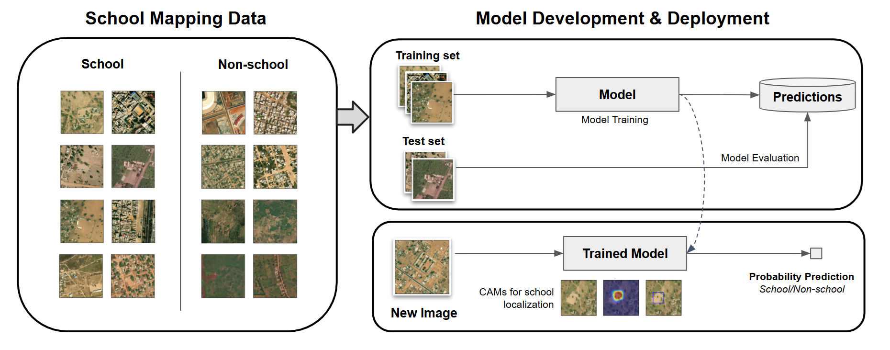

<div style="padding-left: 20px; padding-right: 10px;">
<a href="https://giga.global/">
    
</a>

<div style="padding-top: 20px;"> </div>
<h1><a id="giga-ai" class="anchor" aria-hidden="true" href="#giga-ai"><svg class="octicon octicon-link" viewBox="0 0 16 16" version="1.1" width="16" height="16" aria-hidden="true"></path></svg></a>
UNICEF Giga: AI-enabled School Mapping  </h1> 

<div align="center" >

<!--- These are examples. See https://shields.io for others or to customize this set of shields. You might want to include dependencies, project status and licence info here --->


<!------>


</div>

<details open="open">
	<summary style="padding-bottom: 10px;"><h2>Table of Contents</h2></summary>
  <ol>
    <li><a href="#about-giga">About Giga</a></li>
    <li><a href="#about">About</a>
    <ul>
        <li><a href="#project-objective">Project Objective</a></li>
        <li><a href="#flow-diagram">System Flow Diagram</a></li>
        <li><a href="#giga-repos">Github Repositories</a></li>
        <li><a href="#built-with">Built With</a></li>
      </ul>
      </li>
	<li>
      <a href="#getting-started">Getting Started</a>
    </li>
    <li><a href="#contribution-guidelines">Contribution Guidelines</a></li>
    <li><a href="#code-design">Code Design</a></li>
    <li><a href="#code-of-conduct">Code of Conduct</a></li>
    <li><a href="#license">License</a></li>
    <li><a href="#contact">Contact</a></li>
    <li><a href="#acknowledgements">Acknowledgements</a></li>
  </ol>
</details>


<h2><a id="about-giga" class="anchor" aria-hidden="true" href="#about-giga"><svg class="octicon octicon-link" viewBox="0 0 16 16" version="1.1" width="16" height="16" aria-hidden="true"></path></svg></a>About Giga</h2>

Giga is a UNICEF-ITU global initiative to connect every school to the Internet and every young person to information, opportunity, and choice. By connecting all schools to the Internet, we ensure that every child has a fair shot at success in an increasingly digital world.

<h2><a id="about" class="anchor" aria-hidden="true" href="#about"><svg class="octicon octicon-link" viewBox="0 0 16 16" version="1.1" width="16" height="16" aria-hidden="true"></path></svg></a>
About</h2>

This work leverages deep learning and high-resolution satellite images for automated school mapping and is developed under Giga, a global initiative by UNICEF-ITU to connect every school to the internet by 2030.

Obtaining complete and accurate information on schools locations is a critical first step to accelerating digital connectivity and driving progress towards SDG4: Quality Education. However, precise GPS coordinate of schools are often inaccurate, incomplete, or even completely non-existent in many developing countries.  In support of the Giga initiative, we leverage computer and remote sensing data to accelerate school mapping. This work aims to support government agencies and connectivity providers in improving school location data to better estimate the costs of digitally connecting schools and plan the strategic allocation of their financial resources.

<h3><a id="project-objective" class="anchor" aria-hidden="true" href="#project-objective"><svg class="octicon octicon-link" viewBox="0 0 16 16" version="1.1" width="16" height="16" aria-hidden="true"></path></svg></a>
Project Objective</h3>

- Present a publicly available, end-to-end pipeline for automated school location detection from high-resolution satellite images.
- Help governments improve the quality of school location information in their national register. 
- Identify new, previously unmapped schools in way that is quick, efficient, and scalable.


<h3><a id="flow-diagram" class="anchor" aria-hidden="true" href="#flow-diagram"><svg class="octicon octicon-link" viewBox="0 0 16 16" version="1.1" width="16" height="16" aria-hidden="true"></path></svg></a>
System Flow Diagram </h3>



For each school and non-school location in our dataset, we downloaded 300 x 300 m, 500 x 500 px high-resolution satellite images from Maxar with a spatial resolution of 60 cm/px. 

<h3><a id="giga-repos" class="anchor" aria-hidden="true" href="#giga-repos"><svg class="octicon octicon-link" align="center" viewBox="0 0 16 16" version="1.1" width="16" height="16" aria-hidden="true"></path></svg></a>
Github Repositories </h3>

- [Giga AI-enabled School Mapping](https://github.com/unicef/giga-global-school-mapping/)
- [Giga AI School Validation](https://github.com/unicef/giga-school-mapping-validator)


<h3><a id="built-with" class="anchor" aria-hidden="true" href="#built-with"><svg class="octicon octicon-link" viewBox="0 0 16 16" version="1.1" width="16" height="16"gig aria-hidden="true"></path></svg></a>
Built With </h3>

- <b>ML/DL Frameworks:</b>  Scikit-learn, Pytorch
- <b>Programming Language:</b>  Python
- <b>Geospatial Libraries:</b>  GeoPandas, Rasterio, Fiona, GDAL


<h2><a id="getting-started" class="anchor" aria-hidden="true" href="#getting-started"><svg class="octicon octicon-link" viewBox="0 0 16 16" version="1.1" width="16" height="16" aria-hidden="true"></path></svg></a>
Getting Started</h2>


### Setup
```sh
conda create -n <env_name> python==3.10.13
conda activate <env_name>
pip install -r requirements.txt
```
Add your present working directory (pwd) to your Python path environment variable by adding this line to `~/.profile`:
```sh
export PYTHONPATH=$(pwd)
```
Add the conda environment to jupyterlab:
```sh
conda install ipykernel
ipython kernel install --user --name=<env_name>
```


### Fixing the Google Buildings URL Error
Navigate to your site packages, e.g. `/anaconda/envs/envname/lib/python3.10/site-packages`.
Under `leafmap/common.py`, find the function `download_google_buildings()` and replace the building URL as follows:

```
#building_url = "https://sites.research.google/open-buildings/tiles.geojson"
building_url = "https://openbuildings-public-dot-gweb-research.uw.r.appspot.com/public/tiles.geojson"
```

### Install GDAL/OGR: Follow these [instructions](https://ljvmiranda921.github.io/notebook/2019/04/13/install-gdal/).

<h2><a id="code-design" class="anchor" aria-hidden="true" href="#code-design"><svg class="octicon octicon-link" viewBox="0 0 16 16" version="1.1" width="16" height="16" aria-hidden="true"></path></svg></a>
Code Design</h2>

This repository is divided into the following files and folders:
- **notebooks/**: contains all Jupyter notebooks for exploratory data analysis and model prediction.
- **utils/**: contains utility methods for loading datasets, building model, and performing training routines.
- **src/**: contains scripts runnable scripts for automated data cleaning and model training/evaluation.

## Data Download 
To download the relevant datasets, run either of the following:
- `notebooks/01_data_download.ipynb`
- `python src/data_download.py`:
```s
usage: data_download.py [-h] [--config CONFIG] [--profile PROFILE]

Data Download
options:
  -h, --help         show this help message and exit
  --config CONFIG    Path to the configuration file
  --profile PROFILE  Path to the profile file
```

#### Sample usage
```s
python src/data_download.py --config="configs/data_configs/data_config_ISO_AS.yaml" -- profile="configs/profile.share"
```

Outputs are saved to:
-  `data/vectors/<project_name>/school/` 
- `data/vectors/<project_name>/non_school/`.

## Data Preparation
Run the data cleaning script `src/data_preprocess.py`:
```sh
usage: data_preprocess.py [-h] [--config CONFIG] [--creds CREDS] [--clean_pos CLEAN_POS] [--clean_neg CLEAN_NEG]


Data Cleaning Pipeline

options:
  -h, --help              show this help message and exit
  --config CONFIG         Path to the configuration file
  --sat_config SAT_CONFIG Path to the satellite config file
  --sat_creds SAT_CREDS   Path to the satellite credentials file
  --clean_pos CLEAN_POS   Clean positive samples (bool, default: True)
  --clean_neg CLEAN_NEG   Clean negative samples (bool, default: True)
```

### Cleaning positive samples
- Run data cleaning for the positive samples, e.g.:
```s
python src/data_preprocess.py --config="configs/data_configs/data_config_ISO_AF.yaml" --sat_creds="configs/sat_configs/sat_creds.yaml" --sat_config="configs/sat_configs/sat_config_500x500_60cm.yaml" --clean_neg=False
```
- **Manual Data Cleaning ✨:** Manually inspect and clean the satellite images using `notebooks/03_sat_cleaning.ipynb`. 
-  Vector outputs are saved to `data/vectors/<project_name>/school/clean/<iso_code>_clean.geojson`.  
- Satellite images are saved to `data/rasters/500x500_60cm/<project_name>/<iso_code>/school/`


### Cleaning negative samples
- Run data cleaning for the negative samples, e.g.:
```s
python src/data_preprocess.py --config="configs/data_configs/data_config_ISO_AF.yaml" --sat_creds="configs/sat_configs/sat_creds.yaml" --sat_config="configs/sat_configs/sat_config_500x500_60cm.yaml" --clean_pos=False
```
- Vector outputs are saved to `data/vectors/<project_name>/non_school/clean/<iso_code>_clean.geojson`. 
- Satellite images are saved to `data/rasters/500x500_60cm/<project_name>/<iso_code>/non_school/`. 


## Model Training
To train the computer vision models, run:
```s
sh train.sh
```

Alternatively, you can run `python src/train_cnn.py`:
```s
usage: train_cnn.py [-h] [--config MODEL_CONFIG] [--lr_finder LR_FINDER] [--iso ISO [ISO ...]]

Model Training
options:
  -h, --help              show this help message and exit
  --config MODEL_CONFIG   Path to the model configuration file
  --lr_finder LR_FINDER   Learning rate finder (bool, default: False)
  --iso ISO [ISO ...]     ISO 3166-1 alpha-3 codes
```

#### Sample usage
```sh
python src/train_model.py --config="configs/cnn_configs/convnext_small.yaml" --iso=MNG; 
```

Outputs will be saved to `exp/<project_name>/<iso_code>_<model_name>/` (e.g. `exp/GIGAv2/MNG_convnext_small/`). 

## Model Ensemble
Open `configs/best_models.yaml`. Add an entry for your country of interest (using the country's ISO code), and specify the best model variants for each ViT, Swin, and Convnext in order of model performance, i.e. the first entry is the best-performing model.

#### Sample usage
```sh
MNG:
- "configs/vit_configs/vit_b_16.yaml"
- "configs/cnn_configs/convnext_base.yaml"
- "configs/vit_configs/swin_v2_b.yaml"
```
To evaluate the model ensemble, run `05_model_evaluation.ipynb`. 

## CAM Evaluation
To determine the best CAM method, run `src/cam_evaluate.py`:
```s
usage: cam_evaluate.py [-h] [--model_config MODEL_CONFIG] [--iso_code ISO_CODE]
                       [--percentile PERCENTILE]

CAM Evaluation

options:
  -h, --help                  show this help message and exit
  --model_config MODEL_CONFIG Model config file
  --iso_code ISO_CODE         ISO 3166-1 alpha-3 code
  --percentile PERCENTILE     Percentile (float, default: 90)
```

#### Sample usage
```sh
python src/cam_evaluate.py --iso_code="MNG" --model_config="configs/best_models.yaml"
```

The output will be saved in `exp/<project_name>/<iso_code><best_model_name>/cam_results.csv`.

## Model Deployment
### Download Nationwide Satellite Images
To download nationwide satellite, run `src/sat_batch_download.py`. 
```sh
usage: sat_batch_download.py [-h] [--data_config DATA_CONFIG] [--sat_config SAT_CONFIG] [--sat_creds SAT_CREDS] [--iso_code ISO_CODE] [--adm_level ADM_LEVEL] [--sum_threshold SUM_THRESHOLD] [--buffer_size BUFFER_SIZE] [--spacing SPACING]

Satellite Image Download

options:
  -h, --help                    show this help message and exit
  --data_config DATA_CONFIG     Path to the data configuration file
  --sat_config SAT_CONFIG       Path to the satellite configuration file
  --sat_creds SAT_CREDS         Path to the satellite credentials file
  --iso_code ISO_CODE           ISO 3166-1 alpha-3 code
  --adm_level ADM_LEVEL         Administrative level (string, default ADM2)
  --sum_threshold SUM_THRESHOLD Pixel sum threshold (int, default 5)
  --buffer_size BUFFER_SIZE     Buffer size (int, default 150)
  --spacing SPACING             Sliding window spacing (int, default 150)
```


#### Sample usage
```sh
python src/sat_batch_download.py --data_config="configs/data_configs/data_config_ISO_AS.yaml" --sat_config="configs/sat_configs/sat_config_500x500_60cm.yaml" --sat_creds="configs/sat_configs/sat_creds.yaml" --iso_code=MNG;
```

The satellite images are saved to `output/<iso_code>/images/`.

### Nationwide Model Deployment
For model prediction, run:
```s
sh sat_predict.sh
```

Alternatively, you can run `python src/sat_predict.py`:

#### Sample usage
```sh
python src/sat_predict.py --data_config="configs/data_configs/data_config_ISO_AF.yaml" --model_config="configs/best_models.yaml" --sat_config="configs/sat_configs/sat_config_500x500_60cm.yaml" --sat_creds="configs/sat_configs/sat_creds.yaml" --threshold=0.344 --iso_code=RWA;
```

The outputs are saved to `output/<iso_code>/results/<project_name>/cams/<iso_code>_<best_model_name>_<cam_method>.geojson`.

## File Organization 
The datasets are organized as follows:
```
data
├── rasters
│   ├── maxar
│   │   ├── ISO
│   │   │   ├── school
│   │   │   │    ├── UNICEF-ISO-SCHOOL-00000001.tiff
│   │   │   │    └── ...
│   │   │   ├── non_school
│   │   │   │    ├── UNICEF-ISO-NON_SCHOOL-00000001.tiff
│   │   │   │    └── ...
│   │   │   └── ...
│   │   └── ...
└── vectors
│   ├── school
│   │   ├── unicef
│   │   │   ├──ISO_unicef.geojson
│   │   │   └── ...
│   │   ├── osm
│   │   │   ├──ISO_osm.geojson
│   │   │   └── ...
│   │   ├── overture
│   │   │   ├──ISO_overture.geojson
│   │   │   └── ...
│   └── non_school
│       ├── osm
│       │   ├──ISO_osm.geojson
│       │   └── ...
│       └── overture
│           ├──ISO_overture.geojson
│           └── ...
output
├── ISO
│   ├── geotiff
│   ├── images
│   ├── results
│   │     └──<project_name>
│   │        ├── cams
│   │        └── tiles
│   └── tiles
└── ...   
```

<h2><a id="contribution-guidelines" class="anchor" aria-hidden="true" href="#contribution-guidelines"><svg class="octicon octicon-link" viewBox="0 0 16 16" version="1.1" width="16" height="16" aria-hidden="true"></path></svg></a>
Contribution Guidelines</h2>

Thank you for considering contributing to Giga! We value your input and aim to make the contribution process as accessible and transparent as possible. Whether you're interested in reporting bugs, discussing code, submitting fixes, proposing features, becoming a maintainer, or engaging with the Giga community, we welcome your involvement. 

[Click here for detailed Contribution Guidelines](https://github.com/unicef/giga-global-school-mapping/blob/master/Contribution-Guidelines.md) 


<h2><a id="code-of-conduct" class="anchor" aria-hidden="true" href="#code-of-conduct"><svg class="octicon octicon-link" viewBox="0 0 16 16" version="1.1" width="16" height="16" aria-hidden="true"></path></svg></a>
Code of Conduct</h2>

At Giga, we're committed to maintaining an environment that's respectful, inclusive, and harassment-free for everyone involved in our project and community. We welcome contributors and participants from diverse backgrounds and pledge to uphold the standards. 

[Click here for detailed Code of Conduct](https://github.com/unicef/giga-global-school-mapping/blob/master/CODE_OF_CONDUCT.md) 

<h2><a id="contact" class="anchor" aria-hidden="true" href="#contact"><svg class="octicon octicon-link" viewBox="0 0 16 16" version="1.1" width="16" height="16" aria-hidden="true"></path></svg></a>
Contact</h2>

Applied Science AI-enabled School Mapping Team:
- Isabelle Tingzon: itingzon@unicef.com 
- Ivan Dotu Rodriguez: jdoturodriguez@unicef.com 

Giga Website: https://giga.global/contact-us/ 


<h2><a id="acknowledgements" class="anchor" aria-hidden="true" href="#acknowledgements"><svg class="octicon octicon-link" viewBox="0 0 16 16" version="1.1" width="16" height="16" aria-hidden="true"></path></svg></a>
Acknowledgments💜</h2> 
Global high-resolution satellite images (60 cm/px) from Maxar made available with the generous support of the US State Department. We are also grateful to Dell for providing us with access to High Performance Computing (HPC) clusters with NVIDIA GPU support. 